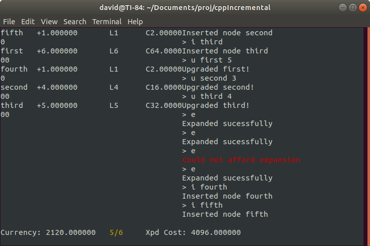

# cppIncremental

This is a simple console-based incremental game written in C++.
It's not really meant to be super fun - it's designed moreso around providing a framework for developing more complex games. It uses a flexible underlying design that should allow for easy and relatively scalable development. It utilises some basic threading capabilities which can potentially provide excellent scaling depending on the data model implementation.

# Building this project

There is a Makefile provided to build this project. All source files are in ./src/cpp/. 
This project uses the c++11 standard, and uses the NCurses library for console output. Most Linux distributions and modern Macs come with NCurses already installed. If you want to use this on Windows, it is highly recommended that you use a proper console because of this.

# Playing this game

The premise of the game is fairly straightforward. You have a particular amount of 'currency', and a finite number of 'nodes' you can create at any given time. Nodes generate some currency, but you can spend currency to increase the amount they generate. You can also spend currency to expand the maximum number of nodes you can have at once. There isn't any fixed endpoint for this game, though it will eventually break the screen contraints of your console - scrolling wasn't implemented for the nodelist.

All input is provided via a simple command line at the bottom of the screen. 'H' provides you with a list of possible commands, and 'Q' will terminate the application.

# Known issues

The resizing functionality is still a bit finicky, depending on what console you use and how hard you try to break it. I'd avoid significant resizing of your terminal if at all possible.

# The future of this project

I'm fairly satisfied with where this project has ended up. I probably won't be continuing this much further. If you want to contribute, I'm very open to pull requests. I'm licensing this under GPL3.0, so feel free to fork this for your own personal use (though I'd be delighted to see someone make something out of it, so make sure to let me know if you do).

